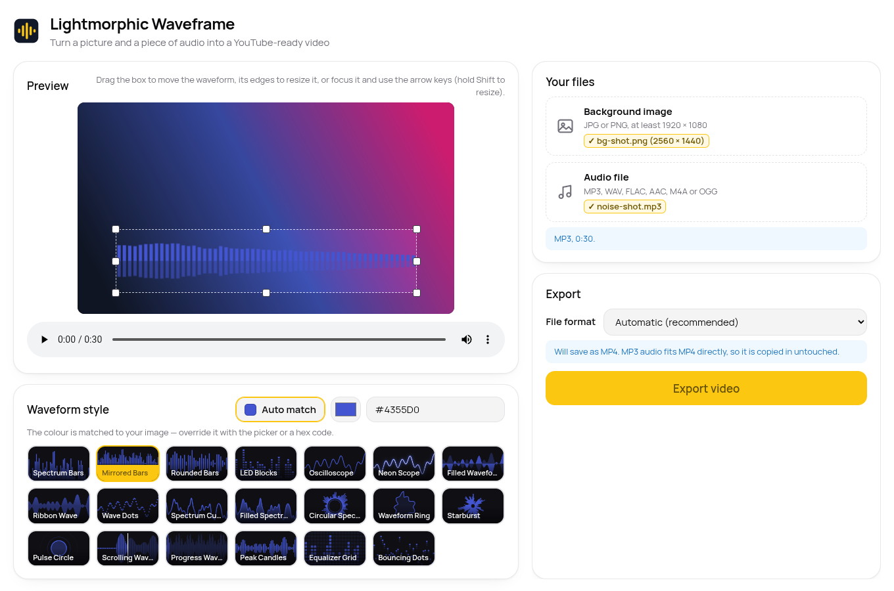
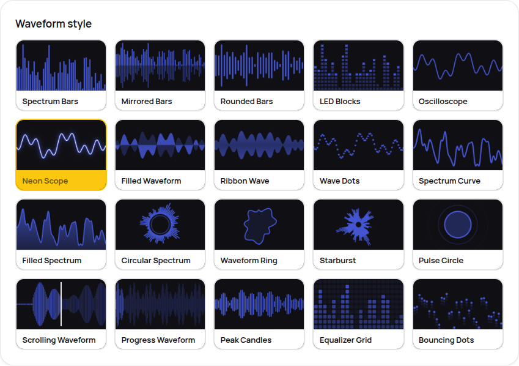

# Lightmorphic Waveframe

Turn a background image and an audio file into a YouTube-ready video with an
animated waveform, without your audio ever being touched.



## What it does

1. Drop in a background image (JPG or PNG, at least 1920 × 1080).
2. Drop in your audio (MP3, WAV, FLAC, AAC/M4A or OGG).
3. Drag and resize the box where the waveform should appear.
4. Pick one of 20 waveform styles. Every style shows a live animated preview.
5. The waveform colour is matched to your image automatically, or pick your own.
6. Export. You get a 1920 × 1080 (1080p) video, ready to upload.

**Your audio is copied into the video bit-for-bit.** Waveframe never
re-encodes, resamples or trims it. The output container is picked to make
that possible: MP4 when your audio fits it (MP3, AAC/M4A), MKV otherwise
(WAV, FLAC, OGG). YouTube accepts both. If you force MP4 for audio that
doesn't fit, Waveframe tells you plainly and saves an MKV instead of
quietly re-encoding.



## Download

Grab the latest AppImage from the
[Releases page](https://github.com/lightmorphic/waveframe/releases/latest),
then:

```bash
chmod +x Lightmorphic-Waveframe-*.AppImage
./Lightmorphic-Waveframe-*.AppImage
```

No installation, no dependencies. FFmpeg is bundled inside.

## Building from source

You need Node.js 20+ on Linux.

```bash
git clone https://github.com/lightmorphic/waveframe.git
cd waveframe
npm install
npm start          # run in development
npm test           # full end-to-end test suite (drives the real app)
npm run build      # build the AppImage into dist/
```

The test suite exports real videos and verifies, among other things, that
the audio stream in each output is bit-for-bit identical to the source file
(compared by checksum).

Day-to-day instructions (running, releasing, rolling back) live in
[docs/RUNBOOK.md](docs/RUNBOOK.md).

## Licence

[GPL-3.0-or-later](LICENSE). The bundled FFmpeg build is GPL; the Manrope
font is under the SIL Open Font License (see `src/renderer/fonts/OFL.txt`).

Website: [waveframe.lightmorphic.co.uk](https://waveframe.lightmorphic.co.uk)
